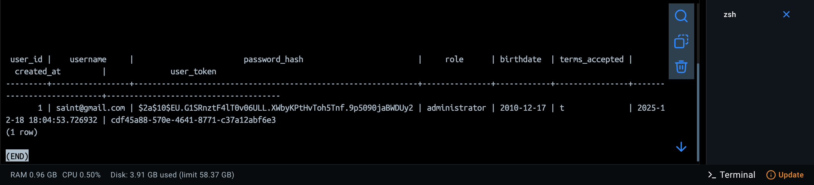
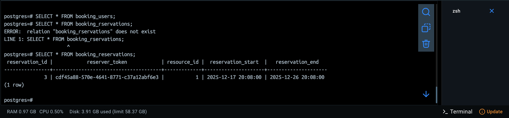

# Phase 4 – GDPR & Booking System Documentation

## 📋 Overview
This folder contains all required documentation and evidence for Phase 4:

- [PrivacyPolicy.md](./PrivacyPolicy.md)
- [TermsOfService.md](./TermsOfService.md)
- [CookiePolicy.md](./CookiePolicy.md)
- [GDPR_Checklist.md](./GDPR_Checklist.md)

## 🗄️ Database Evidence
Below are screenshots showing the database schema and user/reservation tables:

### 1. Schema Overview

### 2. booking_users Table

### 3. booking_reservations Table

> 📌 Place your screenshots inside a `screenshots/` folder under `Phase4`.

## ✅ Notes
- Passwords are stored securely using **bcrypt hashing**.
- `terms_accepted` field ensures GDPR consent at registration.
- `user_token` is used for pseudonymization in reservations.
- Admin role enforces access control for resources and reservations.

## 📌 Submission Checklist
- [x] Privacy Policy
- [x] Terms of Service
- [x] Cookie Policy
- [x] GDPR Checklist
- [x] Database schema screenshots
